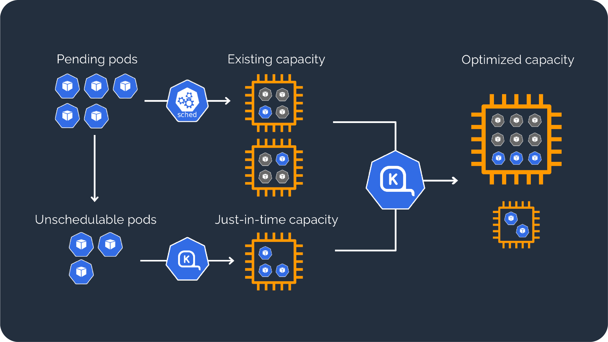

  

    
      
    <i>Autoscale GKE cluster nodes efficiently and cost-effectively.</i>
  

> [!NOTE]  
> A preview version is now available. Please visit [the charts directory](https://github.com/cloudpilot-ai/karpenter-provider-gcp/tree/main/charts) for more information.
> 
> **Feedback welcome!** Join our [Slack](https://join.slack.com/t/cloudpilotaicommunity/shared_invite/zt-37rwpf8k7-Rx4BjrhuWtk9U0MXBKYL7A) or [Discord](https://discord.gg/WxFWc87QWr) to share your ideas, ask questions, and discuss with the community.

## Introduction

Karpenter is an open-source node provisioning project built for Kubernetes.
Karpenter improves the efficiency and cost of running workloads on Kubernetes clusters by:

* **Watching** for pods that the Kubernetes scheduler has marked as unschedulable
* **Evaluating** scheduling constraints (resource requests, nodeselectors, affinities, tolerations, and topology spread constraints) requested by the pods
* **Provisioning** nodes that meet the requirements of the pods
* **Removing** the nodes when the nodes are no longer needed

## How it works

Karpenter observes the aggregate resource requests of unscheduled pods and makes decisions to launch and terminate nodes to minimize scheduling latencies and infrastructure cost.

  

    
  

<!--
## Getting started

* [Introduction](https://docs.cloudpilot.ai/karpenter/gcp)
* [Installation](https://docs.cloudpilot.ai/karpenter/gcp/installation)

## Documentation

Full documentation is available at [karpenter gcp cloud provider docs](https://docs.cloudpilot.ai/karpenter/gcp/).
-->

## Community

We want your contributions and suggestions! One of the easiest ways to contribute is to participate in discussions on the Github Issues/Discussion, chat on IM or the bi-weekly community calls.

* [Slack channel](https://cloudpilotaicommunity.slack.com/archives/C093V65481H)
* [Discord](https://discord.gg/WxFWc87QWr)

## Attribution Notice

This project includes code derived from karpenter-provider-aws, used under the Apache License, Version 2.0 terms. We acknowledge the contributions of the original authors and thank them for making their work available. For more details, see the [karpenter-provider-aws](https://github.com/aws/karpenter-provider-aws).

## Code Of Conduct

Karpenter GCP Cloud Provider adopts [CNCF code of conduct](https://github.com/cncf/foundation/blob/master/code-of-conduct.md).

## License

Karpenter GCP Cloud Provider is under the Apache 2.0 license. See the [LICENSE](LICENSE) file for details.
