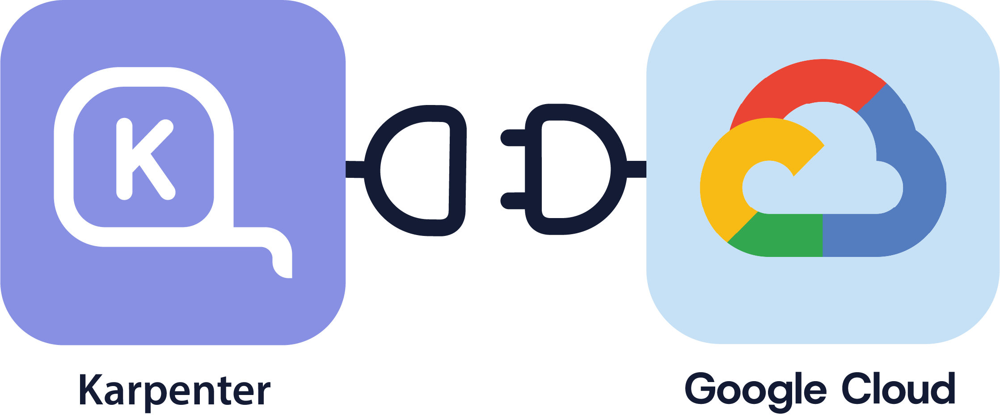
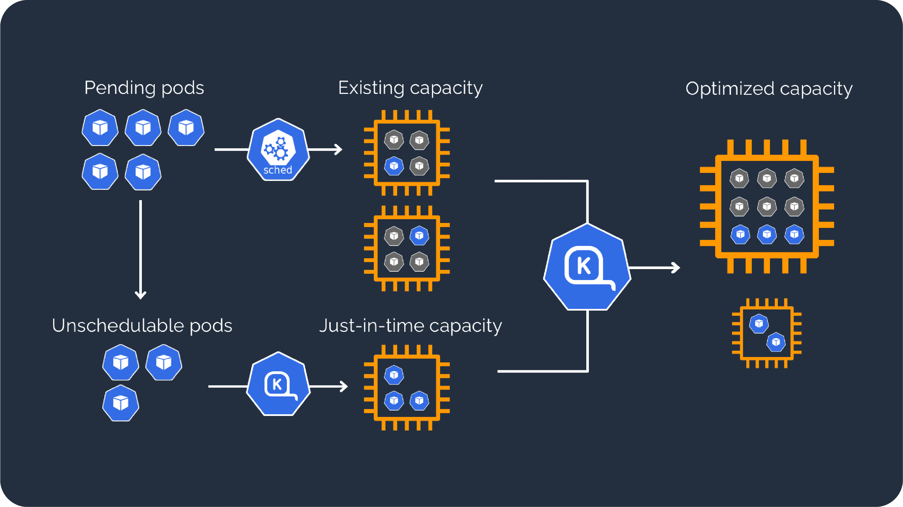
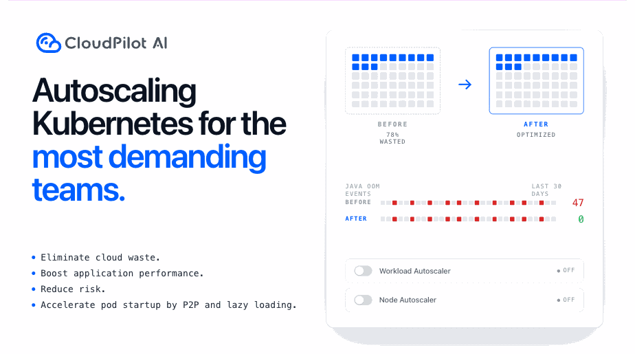

  

    
      
    <i>Autoscale GKE cluster nodes efficiently and cost-effectively.</i>
  

> [!NOTE]
> A live version is now available.
>
> **Feedback welcome!** Join our [Slack](https://kubernetes.slack.com/archives/C0B20K4KWP8) to share your ideas, ask questions, and discuss with the community.

## Introduction

Karpenter is an open-source node provisioning project built for Kubernetes.
Karpenter improves the efficiency and cost of running workloads on Kubernetes clusters by:

* **Watching** for pods that the Kubernetes scheduler has marked as unschedulable
* **Evaluating** scheduling constraints (resource requests, nodeselectors, affinities, tolerations, and topology spread constraints) requested by the pods
* **Provisioning** nodes that meet the requirements of the pods
* **Removing** the nodes when the nodes are no longer needed

## How it works

Karpenter observes the aggregate resource requests of unscheduled pods and makes decisions to launch and terminate nodes to minimize scheduling latencies and infrastructure cost.

  

    
  

## Karpenter and GKE ComputeClasses

Karpenter and [GKE custom ComputeClasses](https://cloud.google.com/kubernetes-engine/docs/concepts/about-custom-compute-classes) both provide workload-driven compute. ComputeClasses offer a GKE-managed way to describe preferred capacity, while Karpenter provides an open and extensible provisioning layer with direct control over compute selection and node lifecycle.

Choose Karpenter when extensibility and infrastructure control matter:

* **Extensible by design** — Karpenter's controller and cloud-provider architecture can be extended with new provisioning, scheduling, pricing, lifecycle, and repair capabilities. Teams can evolve the provisioner with their platform instead of waiting for those capabilities to become available in a specific GKE release.
* **A consistent multi-cloud model** — Karpenter uses the same core `NodePool` and `NodeClaim` APIs and operational model across AWS, Azure, and GCP. Provider-specific settings remain in each `NodeClass`, while shared policies, automation, and tooling can follow the same pattern. This reduces friction for multi-cloud platforms and future cloud migrations.
* **Direct, workload-aware provisioning** — Karpenter evaluates native pod requests and scheduling constraints, bin-packs pending workloads, and directly creates the best-fitting GCE VM for each decision. This removes the managed node pool as a provisioning layer and avoids maintaining a node pool for every capacity shape.

GKE ComputeClasses are a good fit when fully managed GKE integration, especially Autopilot, is the primary goal. For platform teams that expect to customize autoscaling, operate across clouds, or retain deeper control over infrastructure decisions, Karpenter provides the more adaptable foundation. Karpenter Provider for GCP currently targets GKE Standard clusters.

## Managed optimization for production Kubernetes

For teams running Karpenter in production, [CloudPilot AI](https://www.cloudpilot.ai/en/) adds managed cost optimization, reliability automation, deeper cluster visibility, and advanced production features.

  

    
  

Learn more about [CloudPilot AI](https://www.cloudpilot.ai/en/) or [get in touch](https://www.cloudpilot.ai/en/contact/) for production support.

## Documentation

See [`docs/`](docs/) for installation, configuration, networking, troubleshooting, and contributing guides. See [`proposals/`](proposals/) for accepted and in-progress design proposals.

## Release notes / upgrades

See [GitHub Releases](https://github.com/cloudpilot-ai/karpenter-provider-gcp/releases) for the full changelog. See [`MIGRATION.md`](MIGRATION.md) for breaking changes and upgrade steps.

## Community

We want your contributions and suggestions! One of the easiest ways to contribute is to participate in discussions on the Github Issues/Discussion or chat on Slack.

* [Slack channel](https://kubernetes.slack.com/archives/C0B20K4KWP8)

## Sponsors

End-to-end testing infrastructure for this project is generously provided by [PlanetScale](https://planetscale.com), the fastest Postgres and MySQL.&nbsp;
<a href="https://planetscale.com"><picture><source media="(prefers-color-scheme: dark)" srcset="https://planetscale.com/brand/planetscale-logo-mark-white.svg"></picture></a>

## Attribution Notice

This project includes code derived from karpenter-provider-aws, used under the Apache License, Version 2.0 terms. We acknowledge the contributions of the original authors and thank them for making their work available. For more details, see the [karpenter-provider-aws](https://github.com/aws/karpenter-provider-aws).

## Code Of Conduct

Karpenter GCP Cloud Provider adopts [CNCF code of conduct](https://github.com/cncf/foundation/blob/master/code-of-conduct.md).

## License

Karpenter GCP Cloud Provider is under the Apache 2.0 license. See the [LICENSE](LICENSE) file for details.
