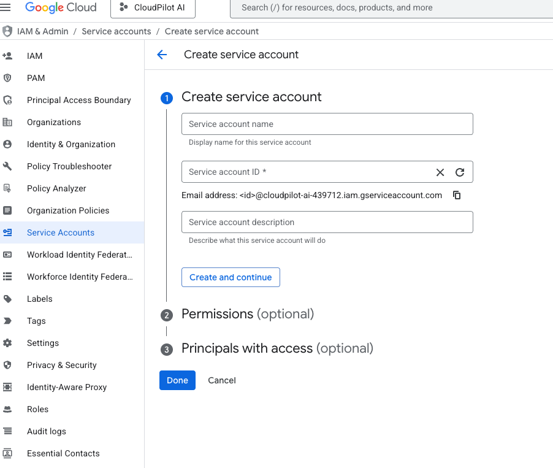
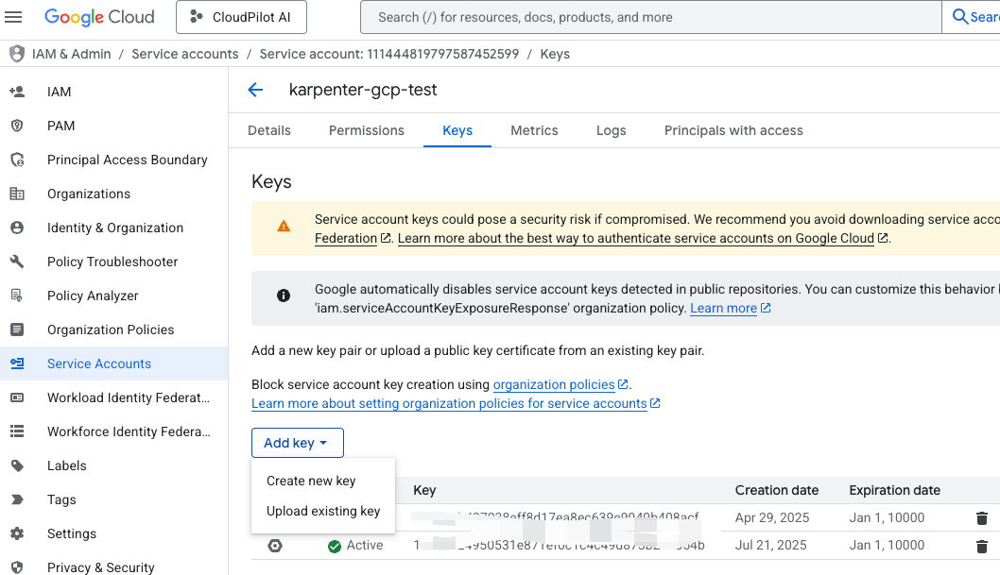

# Karpenter

A Helm chart for deploying Karpenter, an open-source Kubernetes node provisioning project.
This documentation guides you through installing and configuring Karpenter on GKE using Helm.

## Prepare the GCP Credentials

### Enable Required APIs

Enable the necessary Google Cloud APIs for Karpenter to manage compute and Kubernetes resources:

```sh
gcloud services enable compute.googleapis.com
gcloud services enable container.googleapis.com
```

### Create Service Account and Download Keys

Create a service account with the following roles: Compute Admin, Kubernetes Engine Admin, Monitoring Admin, and Service Account User. After creating the service account, download the key file and store it securely.




### Create Cluster Secret

Create a Kubernetes Secret to store your GCP service account credentials:

```yaml
apiVersion: v1
kind: Secret
metadata:
  name: karpenter-gcp-credentials
  namespace: karpenter-system
type: Opaque
stringData:
  key.json: |
    {
      "type": "service_account",
      "project_id": "<your-project-id>",
      "private_key_id": "<your-private-key-id>",
      "private_key": "<your-private-key>",
      "client_email": "<your-client-email>",
      "client_id": "<your-client-id>",
      "auth_uri": "https://accounts.google.com/o/oauth2/auth",
      "token_uri": "https://oauth2.googleapis.com/token",
      "auth_provider_x509_cert_url": "https://www.googleapis.com/oauth2/v1/certs",
      "client_x509_cert_url": "<your-client-x509-cert-url>",
      "universe_domain": "googleapis.com"
    }
```

Save the above as `karpenter-gcp-credentials.yaml`, then apply it to your cluster:

```sh
kubectl create ns karpenter-system
kubectl apply -f karpenter-gcp-credentials.yaml
```

## Installing the Chart

Set the required environment variables before installing the chart:

```sh
export PROJECT_ID=<your-google-project-id>
export CLUSTER_NAME=<gke-cluster-name>
export REGION=<gke-region-name>
# Optional: Set the GCP service account email if you want to use a custom service account for the default node pool templates
export DEFAULT_NODEPOOL_SERVICE_ACCOUNT=<your-custom-service-account-email>
```

Then clone this repository and install the chart with the following command:

```sh
helm upgrade karpenter charts/karpenter --install \
  --namespace karpenter-system --create-namespace \
  --set "controller.settings.projectID=${PROJECT_ID}" \
  --set "controller.settings.region=${REGION}" \
  --set "controller.settings.clusterName=${CLUSTER_NAME}" \
  --wait
```

## Testing Node Creation

### 1. Create NodeClass and NodePool

Replace `<service_account_email_created_before>` with the email of the service account you created earlier:

```sh
cat > nodeclass.yaml <<EOF
apiVersion: karpenter.k8s.gcp/v1alpha1
kind: GCENodeClass
metadata:
  name: default-example
spec:
  serviceAccount: "<service_account_email_created_before>"
  imageSelectorTerms:
    - alias: ContainerOptimizedOS@latest
  tags:
    env: dev
EOF

kubectl apply -f nodeclass.yaml

cat > nodepool.yaml <<EOF
apiVersion: karpenter.sh/v1
kind: NodePool
metadata:
  name: default-nodepool
spec:
  weight: 10
  template:
    spec:
      nodeClassRef:
        name: default-example
        kind: GCENodeClass
        group: karpenter.k8s.gcp
      requirements:
        - key: "karpenter.sh/capacity-type"
          operator: In
          values: ["on-demand", "spot"]
        - key: "karpenter.k8s.gcp/instance-family"
          operator: In
          values: ["n4-standard", "n2-standard", "e2"]
        - key: "kubernetes.io/arch"
          operator: In
          values: ["amd64"]
        - key: "topology.kubernetes.io/zone"
          operator: In
          values: ["us-central1-c", "us-central1-a", "us-central1-f", "us-central1-b"]
EOF

kubectl apply -f nodepool.yaml
```

### 2. Create a Workload

```sh
cat > deployment.yaml <<EOF
apiVersion: apps/v1
kind: Deployment
metadata:
  name: inflate
spec:
  replicas: 1
  selector:
    matchLabels:
      app: inflate
  template:
    metadata:
      labels:
        app: inflate
    spec:
      affinity:
        nodeAffinity:
          requiredDuringSchedulingIgnoredDuringExecution:
            nodeSelectorTerms:
              - matchExpressions:
                  - key: karpenter.sh/capacity-type
                    operator: Exists
      securityContext:
        runAsUser: 1000
        runAsGroup: 3000
        fsGroup: 2000
      containers:
      - image: public.ecr.aws/eks-distro/kubernetes/pause:3.2
        name: inflate
        resources:
          requests:
            cpu: 250m
            memory: 250Mi
        securityContext:
          allowPrivilegeEscalation: false
EOF

kubectl apply -f deployment.yaml
```

Now, check the nodes to see those created by Karpenter:

```sh
$ kubectl get node
NAME                                       STATUS   ROLES    AGE     VERSION
gke-cluster-1-test-default-1c921401-kzbh   Ready    <none>   17d     v1.32.4-gke.1415000
gke-cluster-1-test-default-84243800-v30f   Ready    <none>   17d     v1.32.4-gke.1415000
gke-cluster-1-test-default-b4608681-5zq5   Ready    <none>   17d     v1.32.4-gke.1415000
karpenter-default-nodepool-sp86k           Ready    <none>   18s     v1.32.4-gke.1415000

$ kubectl get nodeclaim
NAME                     TYPE       CAPACITY   ZONE            NODE                               READY   AGE
default-nodepool-sp86k   e2-small   spot       us-central1-a   karpenter-default-nodepool-sp86k   True    46s
```

## Uninstalling the Chart

```sh
helm uninstall karpenter --namespace karpenter-system
kubectl delete ns karpenter-system
```
