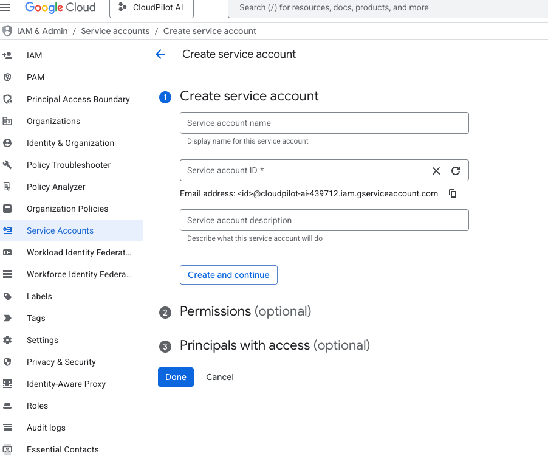
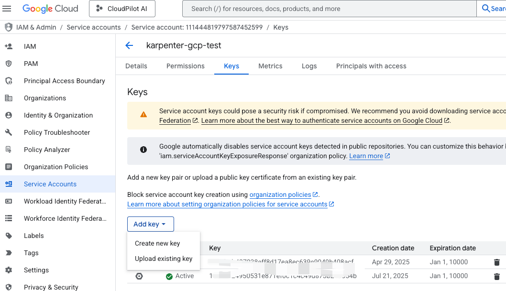

# Karpenter Installation Guide

A guide for deploying Karpenter on Google Kubernetes Engine (GKE) using Helm.

For the full documentation including GCENodeClass reference, NodePool examples, and troubleshooting, see the [docs](../docs/index.md).

## Prerequisites

Before installing Karpenter, ensure you have the following:
- `gcloud` CLI configured with appropriate permissions
- `kubectl` configured to access your GKE cluster
- `helm` installed

Enable the required Google Cloud APIs:
```sh
gcloud services enable compute.googleapis.com
gcloud services enable container.googleapis.com
```

## Installation Methods

Choose one of the following installation methods based on your security requirements:

### Method 1: Workload Identity (Recommended)

Workload Identity provides secure access to Google Cloud services without storing service account keys in your cluster.

#### 1. Create GCP Service Account

Create a GCP Service Account with the necessary roles:

```sh
export PROJECT_ID=<your-google-project-id>
export GSA_NAME=karpenter-gsa

# Create Google Service Account
gcloud iam service-accounts create $GSA_NAME --project=$PROJECT_ID

# Add required IAM roles
gcloud projects add-iam-policy-binding $PROJECT_ID \
    --member="serviceAccount:$GSA_NAME@$PROJECT_ID.iam.gserviceaccount.com" \
    --role="roles/compute.admin"
gcloud projects add-iam-policy-binding $PROJECT_ID \
    --member="serviceAccount:$GSA_NAME@$PROJECT_ID.iam.gserviceaccount.com" \
    --role="roles/container.admin"
gcloud projects add-iam-policy-binding $PROJECT_ID \
    --member="serviceAccount:$GSA_NAME@$PROJECT_ID.iam.gserviceaccount.com" \
    --role="roles/iam.serviceAccountUser"
```

#### 2. Install Karpenter with Helm

Set the required environment variables before installing the chart:

```sh
export PROJECT_ID=<your-google-project-id>
export CLUSTER_NAME=<gke-cluster-name>
export REGION=<gke-region-name>
# Optional: Set the GCP service account email if you want to use a custom service account for the default node pool templates
export DEFAULT_NODEPOOL_SERVICE_ACCOUNT=<your-custom-service-account-email>
```

Then install the chart with the following command:

```sh
# For Workload Identity
helm repo add karpenter-provider-gcp https://cloudpilot-ai.github.io/karpenter-provider-gcp

helm upgrade karpenter karpenter-provider-gcp/karpenter --install \
  --namespace karpenter-system --create-namespace \
  --set "controller.settings.projectID=${PROJECT_ID}" \
  --set "controller.settings.clusterLocation=${REGION}" \
  --set "controller.settings.clusterName=${CLUSTER_NAME}" \
  --set "credentials.enabled=false" \
  --set "serviceAccount.annotations.iam\.gke\.io/gcp-service-account=karpenter-gsa@${PROJECT_ID}.iam.gserviceaccount.com" \
  --wait
```

#### 3. Configure Workload Identity Binding

Allow the Kubernetes service account to impersonate the GCP service account:
```sh
gcloud iam service-accounts add-iam-policy-binding $GSA_NAME@$PROJECT_ID.iam.gserviceaccount.com \
    --role roles/iam.workloadIdentityUser \
    --member "serviceAccount:$PROJECT_ID.svc.id.goog[karpenter-system/karpenter]"
```


### Method 2: Service Account Keys

Note: This method is less secure as it stores credentials in the cluster. Use only if Workload Identity is not available.

#### 1. Create Service Account and Generate Keys

Create a service account with the following roles: `Compute Admin`, `Kubernetes Engine Admin`, `Monitoring Admin`, and `Service Account User`. After creating the service account, download the key file and store it securely.




#### 2. Create Cluster Secret

Create a Kubernetes Secret to store your GCP service account credentials:

```yaml
apiVersion: v1
kind: Secret
metadata:
  name: karpenter-gcp-credentials
  namespace: karpenter-system
type: Opaque
stringData:
  key.json: |
    {
      "type": "service_account",
      "project_id": "<your-project-id>",
      "private_key_id": "<your-private-key-id>",
      "private_key": "<your-private-key>",
      "client_email": "<your-client-email>",
      "client_id": "<your-client-id>",
      "auth_uri": "https://accounts.google.com/o/oauth2/auth",
      "token_uri": "https://oauth2.googleapis.com/token",
      "auth_provider_x509_cert_url": "https://www.googleapis.com/oauth2/v1/certs",
      "client_x509_cert_url": "<your-client-x509-cert-url>",
      "universe_domain": "googleapis.com"
    }
```

Save the above as `karpenter-gcp-credentials.yaml`, then apply it to your cluster:

```sh
kubectl create ns karpenter-system
kubectl apply -f karpenter-gcp-credentials.yaml
```

#### 3. Install Karpenter with Helm

Set the required environment variables before installing the chart:

```sh
export PROJECT_ID=<your-google-project-id>
export CLUSTER_NAME=<gke-cluster-name>
export REGION=<gke-region-name>
# Optional: Set the GCP service account email if you want to use a custom service account for the default node pool templates
export DEFAULT_NODEPOOL_SERVICE_ACCOUNT=<your-custom-service-account-email>
```

Then install the chart with the following command:

```sh
helm repo add karpenter-provider-gcp https://cloudpilot-ai.github.io/karpenter-provider-gcp

# For Service Account Keys
helm upgrade karpenter karpenter-provider-gcp/karpenter --install \
  --namespace karpenter-system --create-namespace \
  --set "controller.settings.projectID=${PROJECT_ID}" \
  --set "controller.settings.clusterLocation=${REGION}" \
  --set "controller.settings.clusterName=${CLUSTER_NAME}" \
  --wait
```

## Verification

Check that Karpenter pods are running:

```sh
kubectl get pods -n karpenter-system
kubectl logs -n karpenter-system deployment/karpenter
```

Then follow the [quick start guide](../docs/getting-started/quick-start.md) to create a GCENodeClass and NodePool and verify node provisioning.

## Uninstalling the Chart

```sh
helm uninstall karpenter --namespace karpenter-system
kubectl delete ns karpenter-system
```
